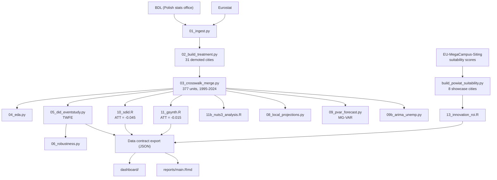

# PL-Capital-Reform-DiD

   

> Causal quasi-experimental analysis of Poland's 1999 administrative reform, which demoted **31 cities** from province capitals.

This is the **causal baseline** of a three-project research programme: Poland's estimated reform cost and MG-VAR dynamics are transferred as structural priors to a parallel [RO-Administrative-Reform](https://github.com/andrm101/ro-administrative-reform) analysis, and its powiat-level suitability scoring links into [EU-MegaCampus-Siting](https://github.com/andrm101/eu-megacampus-siting).

---

## Key findings

- **SDiD ATT on ln(population) = −0.045** (SE = 0.017, significant) — demoted cities lost ~4.5% population relative to synthetic control
- Generalized Synthetic Control (gsynth): average ATT = **−0.015** across 29 treated cities × 29 years — directionally consistent, smaller magnitude
- Triangulated across 6 estimators (TWFE, SDiD, gsynth, Local Projections, MG-VAR, ARIMA) for robustness, not relying on a single identification strategy
- Innovation ROI (Stage 13): per-city Tier-1 multiplier computed for 8 showcase cities using MegaCampus suitability scores — none currently clear the 0.70 Tier-1 gate, so the flat baseline rate applies to all 8 (a verified-correct finding, not an unmodelled gap)
- Interactive dashboard live with a JSON data contract export, including an Innovation Hub scenario toggle

## Identification strategy

Difference-in-Differences with multiple complementary estimators to triangulate the treatment effect of capital-city demotion:

| Estimator | Role |
|---|---|
| TWFE event study | Core identification (05) |
| Synthetic DiD (SDiD) | ATT = −0.045 (SE = 0.017) |
| Generalized Synthetic Control | Avg. ATT = −0.015, 29×29 |
| Local Projections | Impulse-response functions |
| Mixed-Group Panel VAR | 372/377 cities fitted, forward forecasts with fan charts |
| ARIMA | Unemployment forecasting cross-check |

---

## Architecture



---

## Statistical rigour

> Findings are reported as treatment-effect estimates from a quasi-experimental causal design (DiD/SDiD/gsynth), not observational correlations — causal language is appropriate here given the identification strategy, per the project's own causal-inference contract. Effect sizes with standard errors are reported alongside significance throughout.

---

## Status

All estimation stages (01–11b, 09, 09b, 13) are complete; the dashboard is live with a JSON data contract export. Final report (`main.Rmd`) pending separate confirmation.

---

## Running it

```bash
conda env create -f environment.yml
python scripts/01_ingest.py
python scripts/run_r_stages.py   # orchestrates R stages; --force to re-run, --stages to select
```
