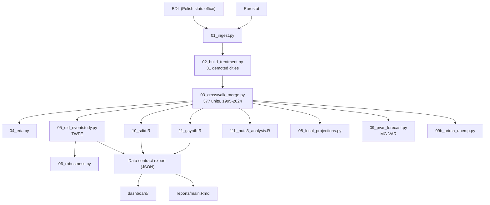

# PL-Capital-Reform-DiD

Causal quasi-experimental analysis of Poland's 1999 administrative reform, which demoted 31 cities from province capitals. Serves as the **causal baseline** for a broader multi-project research programme: Poland's estimated "reform cost" and MG-VAR dynamics are transferred as structural priors to a parallel Romania analysis.

## Status: complete

All estimation stages (01–11b, 09, 09b) are done; dashboard is live with a JSON data contract export. Stage 13 (Innovation ROI) is a stubbed Phase 2 extension. Final report (`main.Rmd`) pending separate confirmation.

## Identification strategy

Difference-in-Differences with multiple complementary estimators to triangulate the treatment effect of capital-city demotion:

- **TWFE event study** — core identification (05)
- **Synthetic Difference-in-Differences (SDiD)** — ATT on ln(population) = −0.045 (SE = 0.017, significant)
- **Generalized Synthetic Control (gsynth)** — 29 treated cities × 29 years, average ATT = −0.015
- **Local Projections** — impulse-response functions
- **Mixed-Group Panel VAR** — 372/377 cities fitted, forward forecasts with fan charts
- **ARIMA** — unemployment forecasting cross-check

## Architecture



## Running it

```bash
conda env create -f environment.yml
python scripts/01_ingest.py
python scripts/run_r_stages.py   # orchestrates R stages; --force to re-run, --stages to select
```

## Statistical rigour

Findings are reported as treatment-effect estimates from a quasi-experimental causal design (DiD/SDiD/gsynth), not observational correlations — causal language is appropriate here given the identification strategy, per the project's own causal-inference contract. Effect sizes with standard errors are reported alongside significance throughout.
